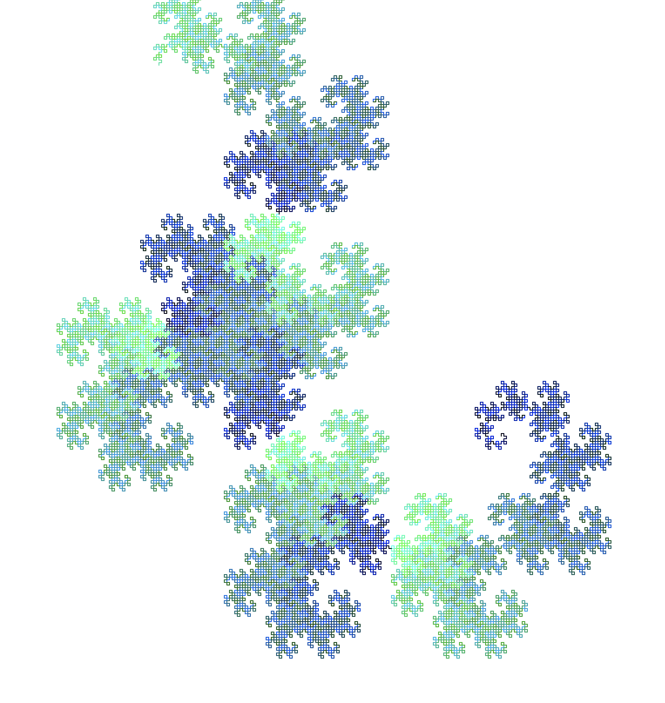

## Comments

This was one of the rare problems when I found myself going off and exploring
topics related to the problem with greater interest than actually completing
the problem.

It involves the Heighway Dragon, a fractal that is the same what happens when
you repeatedly fold a piece of paper along the same axis. It's one of the more
beautiful fractals I've seen, in my opinion at least. What's great about it is
its construction is well suited to turtle graphics.

After making a working solution, I immediately added the Python `turtle` module
to my `Turtle` class. This was super helpful with debugging because I could
easily see the errors in the program and exactly where there were occurring.
But of course, this led me off on a wonderful adventure in drawing.



I would like to further explore ideas of color, line thickness, and angle in
this dragon. Rendering the above image took a very long time and slowed
considerably as it went. I know there must be performance gains to be found.

As far as the problem itself goes, it's recursive, based on powers of 2.
Program runs almost instantly and seems to work with values of $n = 10^10000$
and possibly greater.

## Code

```python
def position_for(pwr, faces):
    val = 1 << pwr // 2
    if faces:
        val = -val
    cycle = pwr % 8

    if cycle == 0:
        return 0, val
    elif cycle == 1:
        return val, val
    elif cycle == 2:
        return val, 0
    elif cycle == 3:
        return val, -val
    elif cycle == 4:
        return 0, -val
    if cycle == 5:
        return -val, -val
    elif cycle == 6:
        return -val, 0
    elif cycle == 7:
        return -val, val

def facing(n):
    return bin(n^(n>>1))[2:].count("1") % 4

def solve(m):

    k = x = y = 0
    while k < m:
        steps = (m - k).bit_length() - 1
        relx, rely = position_for(steps, facing(k))
        x += relx
        y += rely
        k += 1 << steps

    return (x, y)

if __name__ == '__main__':
    import sys
    m = eval(sys.argv[1])
    print(solve(m))
```

## Tests

```python
import pytest
from problem import solve

_test_solve = (
        (1, (0, 1)),
        (2, (1, 1)),
        (3, (1, 0)),
        (4, (2, 0)),
        (5, (2, -1)),
        (6, (1, -1)),
        (7, (1, -2)),
        (8, (2, -2)),
        (9, (2, -3)),
        (10, (1, -3)),
        (11, (1, -2)),
        (12, (0, -2)),
        (13, (0, -3)),
        (14, (-1, -3)),
        (15, (-1, -4)),
        (16, (0, -4)),
        (17, (0, -5)),
        (18, (-1, -5)),
        (19, (-1, -4)),
        (20, (-2, -4)),
        (30, (-5, -3)),
        (40, (-6, -2)),
        (50, (-5, -1)),
        (100, (-6, 4)),
        (200, (-2, 10)),
        (500, (18,16)),
        (10**3, (34, -2)),
        (10**4, (-80, -36)),
        (10**5, (108, 156)),
        (10**6, (-104, -1008)),
)

@pytest.mark.parametrize('m,expect', _test_solve)
def test_solve(m, expect):
    assert expect == solve(m)
```

## Art

```python
import turtle as t

class Turtle(t.Turtle):

    def __init__(self, *args, scale=15, draw=True, **kwargs):
        if draw:
            t.mode('logo')
            t.hideturtle()
            t.setup(width=.90, height=.90)
            super(Turtle, self).__init__(*args, **kwargs)
            self.speed(10)
            self.hideturtle()
            self.color = 0

        self.scale = scale
        self.steps = 0
        self.x = self.y = 0
        self.draw = draw
        self.facing = 0

    def position(self):
        return self.x, self.y

    def forward(self, f):
        self.steps += 1
        facing = self.heading()
        if facing == 0:
            self.y += 1
        elif facing == 90:
            self.x += 1
        elif facing == 180:
            self.y -= 1
        else:
            self.x -= 1

        if self.draw:
            self.color = (self.color + 10) % (16**6)
            color = '#'+hex(self.color)[2:].rjust(6, '0')
            self.pencolor(color)
            super(Turtle, self).forward(f * self.scale)

    def right(self, r):
        self.facing = (self.facing + r) % 360
        if self.draw:
            super(Turtle, self).right(r)

    def left(self, l):
        self.facing = (self.facing - l) % 360
        if self.draw:
            super(Turtle, self).left(l)

    def heading(self):
        return self.facing

def D():
    word = 'R'
    while True:
        new_word = word
        yield from word.split()
        new_word += 'R'
        yield 'R'
        for c in word[::-1]:
            if c == 'R':
                new_word += 'L'
                yield 'L'
            else:
                new_word += 'R'
                yield 'R'
        word = new_word

def solve(m, draw=False):
    turtle = Turtle(scale=3, draw=draw)
    turtle.forward(1)
    for c in D():
        if turtle.steps == m:
            input()
            return turtle.position()
        if c == 'R':
            turtle.right(90)
            turtle.forward(1)
        elif c == 'L':
            turtle.left(90)
            turtle.forward(1)

if __name__ == '__main__':
    import sys
    m = eval(sys.argv[1])
    print(solve(m, draw=True))
```
